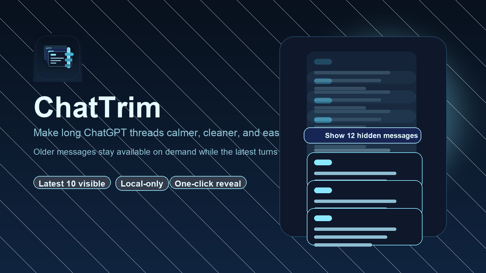
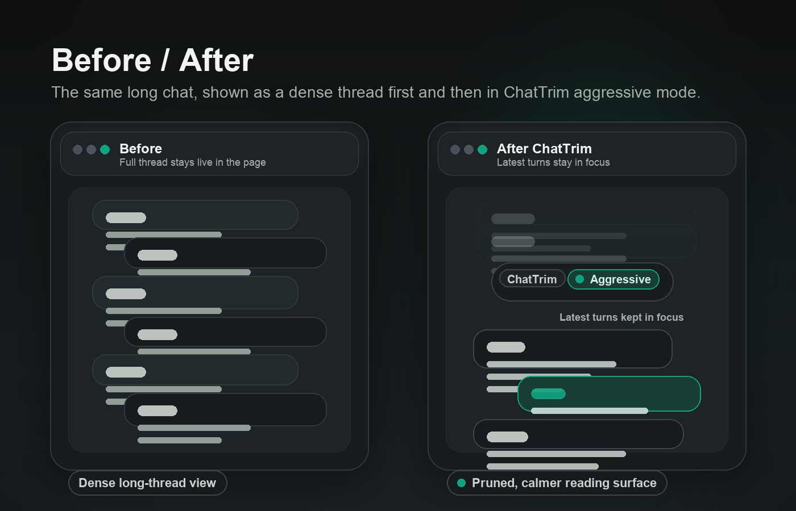

# ChatTrim



[](https://github.com/dkozlov97/chattrim/actions/workflows/validate.yml)
[](LICENSE)
[](https://github.com/dkozlov97/chattrim/releases)

ChatTrim is a tiny Chrome extension that makes long ChatGPT conversations easier to handle by hiding older messages and keeping the latest turns front and center.

It does one job, stays local, and keeps the install story simple.

## Why people use it

- Long ChatGPT threads can feel sluggish or visually overwhelming.
- ChatTrim hides older conversation turns and leaves the newest ones visible.
- A single button reveals hidden messages whenever you want the full context back.
- The extension runs only on ChatGPT pages and makes no network requests of its own.



## Features

- Keeps the latest `10` conversation turns visible by default
- Hides older turns instead of deleting them
- Adds a one-click `Show hidden messages` button
- Re-enables trimming automatically when you navigate to a different chat
- Uses Manifest V3 with no background script and no remote calls

## Install from GitHub

### Option 1: Source checkout

1. Clone this repository or download it as a ZIP and extract it.
2. Open `chrome://extensions`.
3. Enable `Developer mode`.
4. Click `Load unpacked`.
5. Select the project folder.

### Option 2: Release ZIP

1. Download the latest release from the [Releases page](https://github.com/dkozlov97/chattrim/releases).
2. Extract `chattrim-v1.0.0.zip`.
3. Open `chrome://extensions`.
4. Enable `Developer mode`.
5. Click `Load unpacked`.
6. Select the extracted folder.

## How it works

- ChatTrim injects a small content script on `chatgpt.com` and `chat.openai.com`.
- It finds conversation turns in the page DOM and hides all but the latest `10`.
- Hidden messages remain in the page DOM, so the extension is focused on readability and practical UI relief rather than full virtualization.
- If you reveal hidden messages, trimming stays off only for the current chat view and comes back automatically after navigation.

## Permissions and privacy

- Host access is limited to `https://chatgpt.com/*` and `https://chat.openai.com/*`.
- No analytics, no telemetry, no external API calls, and no data storage.
- No background service worker, popup, or account integration.

## Limitations

- ChatGPT is a fast-moving product, so DOM selectors may need updates if the site markup changes.
- Because older messages are hidden rather than removed, this is not the same as true DOM virtualization.
- The visible window size is currently hardcoded in [content.js](content.js) as `VISIBLE_COUNT = 10`.

## Troubleshooting

- If nothing changes on the page, refresh the ChatGPT tab after loading the extension.
- If Chrome warns about unpacked extensions, that is expected for manual installs.
- If ChatGPT ships a DOM update, the fallback selector logic may need an adjustment.

## Development

```bash
python3 scripts/generate_assets.py
bash scripts/build-release.sh
```

The release script creates `dist/chattrim-v1.0.0.zip` with only the files needed to load the extension.

## Chrome Web Store prep

Store-ready listing copy lives in [docs/chrome-web-store.md](docs/chrome-web-store.md).

## Disclaimer

ChatTrim is an independent open-source project and is not affiliated with, endorsed by, or sponsored by OpenAI.
